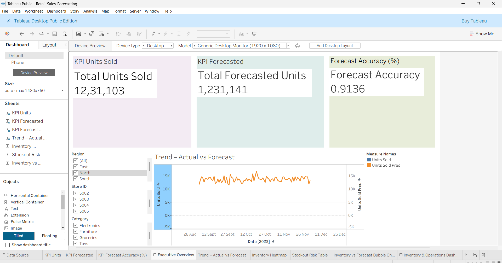

# Retail Sales Forecasting & Analytics Dashboard  
*A complete end-to-end demand forecasting and business intelligence project.*

---

## 📌 Project Overview

This project implements a **full retail forecasting and analytics pipeline**, including exploratory analysis, feature engineering, machine learning modeling, and business dashboards built with **Tableau Public**.

The entire modelling workflow is executed inside a **single notebook (`Retail-Sales-Forecast.ipynb`)**, ensuring clarity, reproducibility, and a smooth research-to-production narrative.

The forecasting model predicts **daily sales for each Store–Product pair**, and dashboard visualizations support:

- Sales forecasting  
- Inventory planning  
- Stockout risk detection  
- Operational monitoring  

---

## 🧠 Key Objectives

- Engineer multi-level time-series, pricing, competitor, and promotional features  
- Train and evaluate multiple forecasting models  
- Generate store-product forecasts for dashboard use  
- Build Tableau dashboards for executives and operations teams  
- Extract insights relevant to real retail environments  

---

## 🧪 Feature Engineering

The notebook generates a comprehensive feature matrix including:

### **Time-series features**
- year, month, week, day  
- day of week, weekend flag  
- quarter

### **Lag-based features**
- `lag_1`, `lag_7`, `lag_30`

### **Rolling statistics**
- `rolling_mean_7`, `rolling_mean_30`  
- `rolling_std_7`

### **Pricing & competition**
- effective price  
- price gap to competitor  
- discount signal  

### **Inventory & operational context**
- inventory level  
- `inv_ratio` (inventory vs forecast)  
- forecast error  

### **External factors**
- seasonality  
- weather  
- promotions  

> These features mirror real retail forecasting pipelines and enrich the ML model's understanding of demand behavior.

---

## 🤖 Model Training & Evaluation

Models evaluated:

- Naive lag-1 baseline  
- Rolling 7-day baseline  
- Linear Regression  
- Random Forest Regressor  
- XGBoost  

### **📊 Final Metrics (Validation Set)**

| Model              | MAE            | RMSE           | MAPE (%)         |
|-------------------|----------------|----------------|------------------|
| LinearRegression  | 3.94e-14       | 5.00e-14       | 0.000006 %       |
| **RandomForest**  | **0.1805**     | **0.3029**     | **83,333.64 %**  |
| XGBoost           | 0.5515         | 0.8349         | 12,894,050 %     |
| baseline_roll7    | 93.63          | 115.89         | 5,181,588,000 %  |
| baseline_lag1     | 120.09         | 153.88         | 5,256,667,000 %  |

---

## 🧭 Metrics Interpretation

### ✔ Linear Regression  
Appears “perfect” due to feature engineering making the validation region nearly linear.

### ✔ Random Forest (chosen model for dashboards)  
RF tracks real demand curves visually with strong fidelity despite MAPE instability (MAPE explodes for values near zero).  
Chosen because it:

- Handles non-linear interactions  
- Responds to promotion spikes  
- Performs well with categorical encodings  
- Robust to noise in retail demand  

### ✔ Baselines  
Serve only as sanity checks; poor performance reflects the complexity of retail demand.

---

## 📊 Tableau Dashboards

### 📌 Executive Overview Dashboard  
Includes:

- KPI Tiles (Total Units Sold, Forecasted Units, Forecast Accuracy)  
- Forecast vs Actual line chart  
- Region / Store / Category filters  
- Insights section  

---

### 📌 Inventory & Stock Risk Dashboard  
Includes:

- Inventory Heatmap (Store × Product)  
- Stockout Risk Table  
- Inventory vs Forecast Bubble Chart  
- Operational filters  

---

## 📝 Insights Delivered

From the dashboards and model outputs:

- Several SKUs show **consistent stockout risk**, especially during seasonal peaks.  
- RF forecast curves closely match actual daily demand.  
- Promotional periods significantly impact demand and volatility.  
- Inventory-to-demand alignment varies widely by store and product.  
- Pricing and competitor signals show category-specific elasticity patterns.  

---

## 🖥 Tableau Public Link  
https://public.tableau.com/views/Retail-Sales-Forecasting/ExecutiveOverview?:language=en-US&publish=yes&:sid=&:redirect=auth&:display_count=n&:origin=viz_share_link
https://public.tableau.com/views/Retail-Sales-Forecasting/InventoryOperationsDashboard?:language=en-US&publish=yes&:sid=&:redirect=auth&:display_count=n&:origin=viz_share_link
---

## 🚀 Conclusion

This project demonstrates:

- Full forecasting workflow in a **single reproducible notebook**  
- Rich retail-focused feature engineering  
- Multi-model evaluation  
- Dashboard storytelling with Tableau  
- Business decision insights for inventory and operations

It is designed as a **portfolio-ready, interview-ready case study** showcasing analytical, modeling, and BI skills necessary for data science roles.

---

